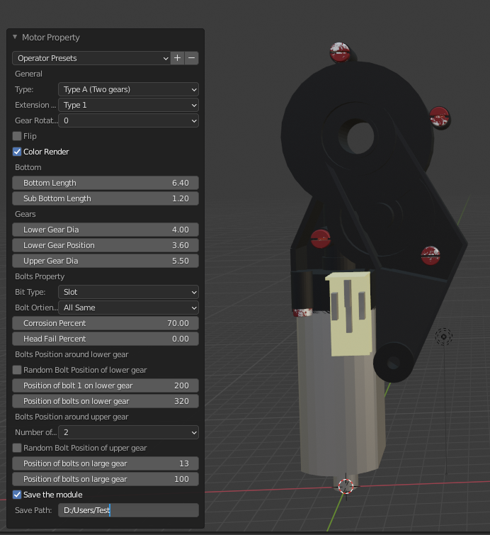
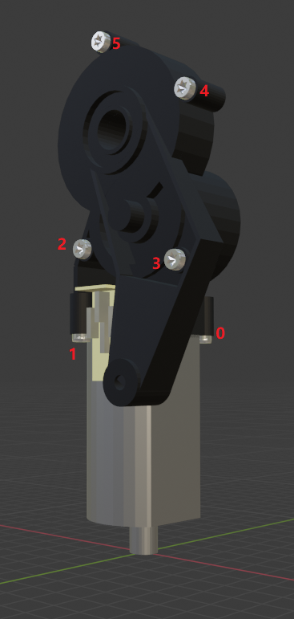
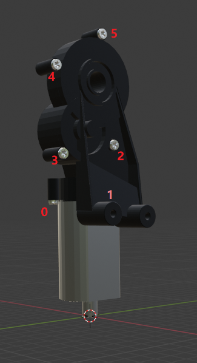
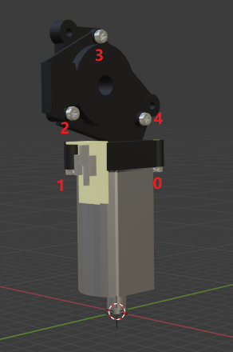

# Blender Motor Factory

This is an blender addon which can create motor. We parameterized many features of a motor and so user can generate various model in same type but different parameters.


## 1. Installation

> **Requirement**:
> - This addon only support [blender version 2.90.1](https://download.blender.org/release/Blender2.90/). Other version may cause unpredictable falier.
> - Blender Bolt Factory should be enabled. It is a default addon in blender, you can enable it in *Edit > Preference > Install > Add Mesh: Bolt Factory*. 

1. Download the project via ``git clone https://github.com/cold-soda-jay/blenderMotorFactory.git`` or download zip file from realese.
2. In Blender, go *Edit > Preference > Install* and find the file **Add Motor.zip**. Make sure it is activated.
3. Now you can find it in *Add >Mesh*

## 2. Advanced

### 2.1 Save model

This Addon allow user generate various model and save the parameter as well as model as .stl file. To save the model, you can run the command in blender Console (**Shift + F4** to open it): 
``bpy.ops.mesh.add_motor(save_path="Path of folder")``

The model will be saved as a whole entity and seperate parts

<div align="left"></div>

<div align="center"></div>

#### Save Model in Blender

When you modified some motor manuelly and want to save the model and property value part by part, you can choose **Save the model** and then give the loaction where you want to save the model. Then the model you created will be saved.

<div align="center"></div>

### 2.2 CSV data

The parameters of generated model will be saved into a csv file when ``save_path`` setted. Every model will be saved in a separate folder with a number as name. This number represent the Id of the model. The parameters of this model can be found in csv file. 


#### Bolt Positions

The position of all bolts will also be saved as a list in the file. The order of bolt position is from bottom to top. See picture below for more details.


<div style="display:block;
float:center;">
<div align="center"></div>
<div style="color: #666; padding: 2px;" align="center"> 
Top Type A with extension 1.
</div>
</div>

<div style="display:block;
float:center;">

<div align="center"></div>
<div style="color: #666; padding: 2px;" align="center"> 

Top Type A with extension 2.
</div>
</div>


<div style="display:block;
float:center;">

<div align="center"></div>
<div style="color: #666; padding: 2px;" align="center"> 

Top Type B with extension 1.
</div>
</div>

Every bolt will have a vector to store its position and orientation. In CSV the last colum stores all bolts positions. The result is a [3\*2\*n] list. Each bolt position will be represented as a vector [
    Top_position(x,y,z), 
    Bottom_position(x,y,z)
].
>      E.g.: [
>            #Bolt 1
>            [
>                [x1,y1,z1],
>                [x2,y2,z2]
>            ],
>            #Bolt 2
>            [
>                [x3,y3,z3],
>                [x4,y4,z4] 
>            ],
>            .....           
>        ] 


### 2.3 Auto generation


To generate more models at once, you can use script ``./src/auto_generate.py``. In the script you can set the number of generated models and define several parameters when generating. Here are all parameters:


**!!Units are cm, degree**

| Variable| Explain|
| :-: |:-|
|mf_Top_Type|Head type of motor: Vaule can be ('mf_Top_Type_A', 'mf_Top_Type_B')|
|mf_Extension_Type_A| Extension Type for Type A: Vaule can be  ('mf_Extension_Type_1', 'mf_Extension_Type_2', 'mf_None')                 |
|mf_Extension_Type_B| Extension Type for Type B: Vaule can be  ('mf_Extension_Type_1', 'mf_None') |
|mf_Gear_Orientation_1| Orientation of top part for extension type 1: Vaule can be  ('r0', r90', 'r180', 'r270')|
|mf_Gear_Orientation_2| Orientation of top part for extension type 2: Vaule can be  ('r90', 'r180', 'r270')|
|mf_Flip| Wheather the top part ne fliped: Vaule can be  (True, Flase)|
|mf_Bottom_Length| Length of bottom part: Vaule can be floate in range [4, 8].|
|mf_Sub_Bottom_Length| Length of sub bottom part (Small cylinder under): Vaule can be floate in range [0.6, 2]. |
|mf_Lower_Gear_Dia| Diameter of lower gear: Vaule can be floate in range [3.5, 4.5]|
|mf_Lower_Gear_Position| Position of lower gear respect to the top of the bottom part: Vaule can be floate in range [3.6, 4.2] |
|mf_Upper_Gear_Dia| Diameter of upper gear: Vaule can be floate in range [5, 6.5]  |
|mf_Bit_Type| Type of bit in bolts: Vaule can be ('mf_Bit_Torx', 'mf_Bit_Slot', 'mf_Bit_Cross', 'mf_Bit_Allen')|
|mf_Bolt_Orientation| Orientation of bolts: Vaule can be ('mf_all_same', 'mf_all_random')|
|mf_Lower_Gear_Bolt_Random| Wheater postion of bolts on lower gear(Type A) should be random: Value can be (True, False)|
|mf_Lower_Gear_Bolt_Position_1| The position of bolt around lower gear: Value in range [190, 230]. Unit degree|
|mf_Lower_Gear_Bolt_Position_2| The position of bolt around lower gear: Value in range [320, 350]. Unit degree|
|mf_Gear_Bolt_Random_B| Wheater postion of bolts on gear(Type B) should be random: Value can be (True, False)|
|mf_Gear_Bolt_Nummber_B | Number of bolt around gear. Can only be modified when mf_Top_Type = 'mf_None'. Value can be 2 or 3|
|mf_Gear_Bolt_Position_B_1| The position of bolt around gear: Value in range [210, 225]. Unit degree|
|mf_Gear_Bolt_Position_B_2| The position of bolt around gear: Value in range [70, 110]. Unit degree|
|mf_Gear_Bolt_Position_B_3| The position of bolt around gear: Value in range [130, 190]. Unit degree|
|mf_Gear_Bolt_Right_B| The position of bolt in right side of gear(Type B). Repect to the top of bottom part: Value in range [1.7, 4]. Unit cm|
|mf_Upper_Bolt_Nummber| Number of Bolts on upper gear (Type A): Value can be 1 or 2 or 3|
|mf_Upper_Gear_Bolt_Random| Wheater postion of bolts on upper gear(Type A) should be random: Value can be (True, False)|
|mf_Upper_Gear_Bolt_Position_1_1| The position of bolt Nr.1 around upper gear when only one bolt: Value in range [0, 210]. Unit degree|
|mf_Upper_Gear_Bolt_Position_1_2| The position of bolt Nr.1 around upper gear when two bolts: Value in range [0, 100]. Unit degree|
|mf_Upper_Gear_Bolt_Position_1_3| The position of bolt Nr.1 around upper gear when three bolts: Value in range [0, 65]. Unit degree|
|mf_Upper_Gear_Bolt_Position_2_1| The position of bolt Nr.2 around upper gear when two bolts: Value in range [110, 210]. Unit degree|
|mf_Upper_Gear_Bolt_Position_2_2| The position of bolt Nr.2 around upper gear when three bolts: Value in range [75, 135]. Unit degree|
|mf_Upper_Gear_Bolt_Position_3| The position of bolt Nr.3 around upper gear when three bolts: Value in range [145, 210]. Unit degree|
|mf_Type_B_Height_1| Height of Extension left relative to the top of the bottom part (mf_Sub_Bottom_Length + mf_Bottom_Length). Value can be in range [1.7, 4]|
|mf_Type_B_Height_2| Height of Extension right relative to the top of the bottom part (mf_Sub_Bottom_Length + mf_Bottom_Length). Value can be in range [5, 6.5]|
|save_path| Path of folder when saving the module.|


After setting the parameters, you can runthe script in command line with following command:

```
path/of/blender -b -P path/of/auto_generate.py 1> nul
```

See more details in `auto_generate.py`
