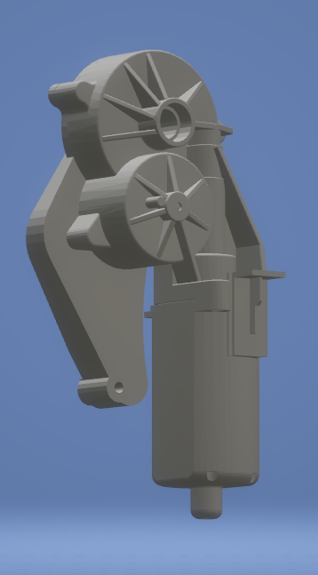

# Motor Factory

## 1. Bottom 2

1. The origin point should be at the bottom
2. The size of sub cylinder inner should be able to change

## 2. Bottom 1

1. Only the length should be changabel

## 3. Middle

1. Fixed size, belong to up2

## 4. Up2

1. 4 convex Cylinder, fixed
2. Cylinder Zone
    - back
    - hole
    - tilt 
    - 4 bolts cylinder

## 5. Up1

1. Cylinder Zone: Amount 6+5
2. Circle Tangent extension zone

# Questions

1. Generate the parts using real size or relative size?
2. Are all gears of one type having same size? Are there two kind of gears?
3. How accurate should it be? Which parts are not so important for learning and which parts are very important?

# Variance need to be modified

## Bottom

1. Length should  be limited

## Up part 2

1. **Cylinder Zone 2 (Small Gear)**
    - Position: Tangent of middle line
    - Radius
    - $\frac{2}{3}$
2. **Large Gear**
    - Postion
    - Radius: Boader at center of small gear 
    - $\frac{1}{3}$
3. **Depth of both gears**
    - Depends on which type 
4. **Left or Right of gears**

## Up part 1

1. Thickness 

## Bolt

> 倒角 (Use sephere)
1. Thickness
3. Radius
4. Bit Type
    - Torx
    - Philips
    - Sloted
    - Hex (Alien)
    - Square
5. Bit radius
2. **Screws**
    - Large Gear: 2
        - Random on up half
        - Sum of angle larger than 120
    - Small Gear: 2
        - Random on bottom half
        - Sum of angle larger than 120
    - Middle: 2 (fixed)

## Extention Zone

1. **Two types**
    - Tangent of large gear
    - Left or Right to the large gear
    - One or two cylinders
3. **Board and details** (less important)

# 5.Okt

1. Bolt rotation
    - all same
    - all random
2. Bit type
3. 4 covex empty zone (1)
4. gear up and down limit (position, dia)
5. Extension Zone
    - type 1
    - type 2
6. Flip
7. Energy part two panels

